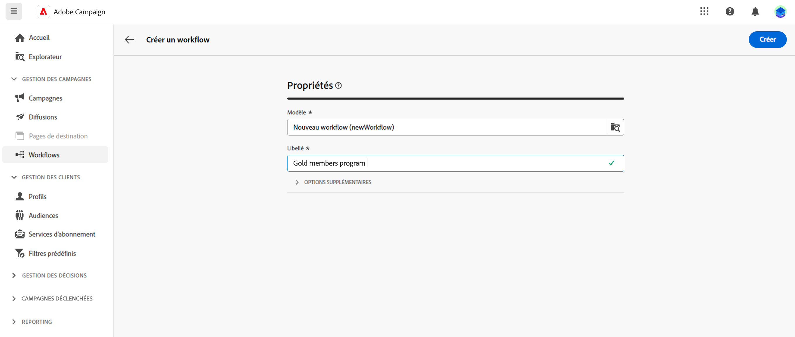
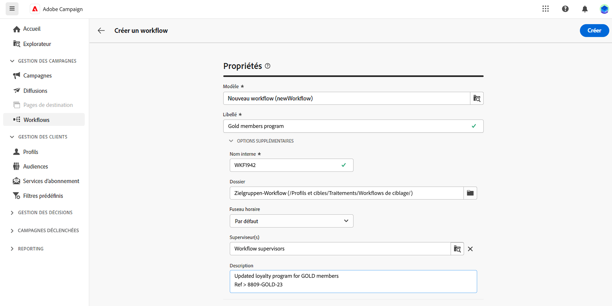
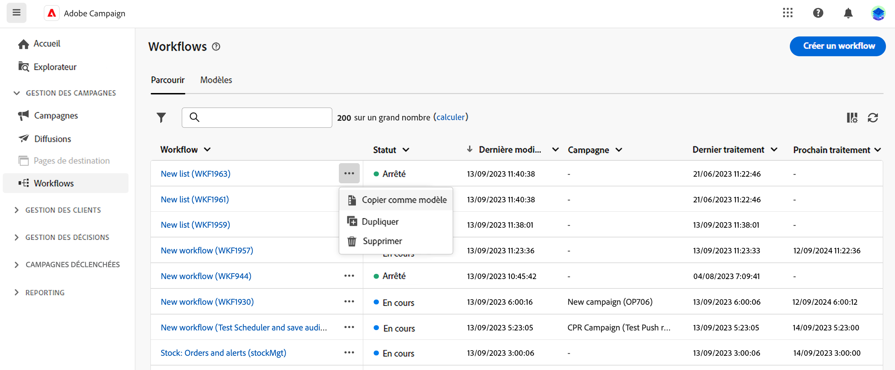
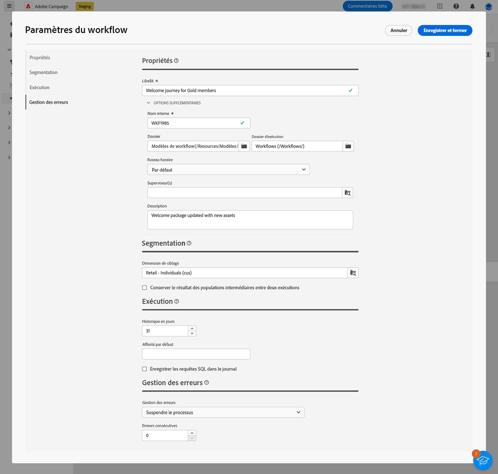
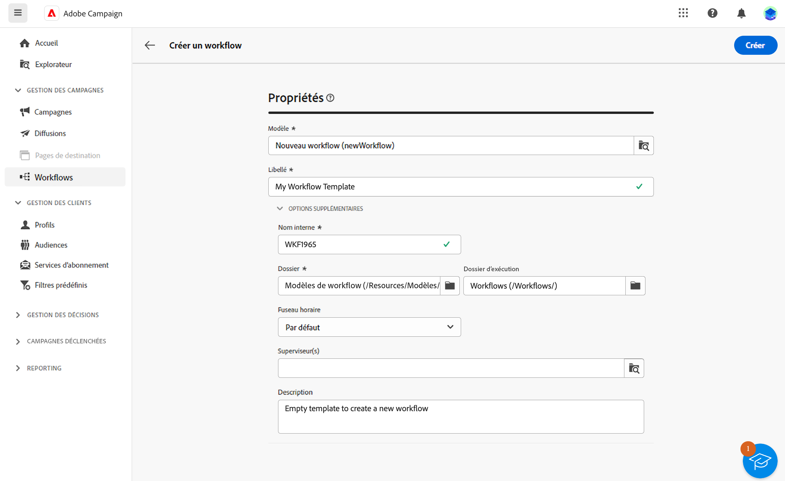
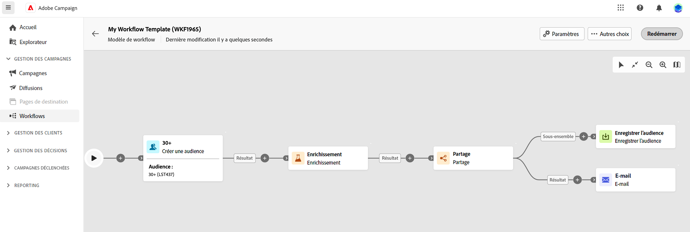

# Créer le workflow {#create-first-workflow}

>[!CONTEXTUALHELP]
>id="acw_workflow_creation_properties"
>title="Propriétés du workflow"
>abstract="Dans cet écran, choisissez le modèle à utiliser pour créer le workflow et indiquez un libellé. Développez la section Options supplémentaires pour configurer d’autres paramètres tels que le nom interne du workflow, son dossier, son fuseau horaire et le groupe de personnes responsables. Il est vivement recommandé de sélectionner un groupe de personnes responsables afin d’alerter les opérateurs et opératrices en cas d’erreur."

>[!CONTEXTUALHELP]
>id="acw_campaign_creation_workflow"
>title="Liste des workflows de la campagne"
>abstract="L’onglet **Workflows** dresse la liste des workflows liés à la campagne. Cliquez sur le nom d’un workflow pour le modifier. Utilisez le bouton **Créer un workflow** pour ajouter un nouveau workflow à cette campagne."

Vous pouvez créer des workflows autonomes ou des workflows au sein d’une campagne. La première étape consiste à sélectionner un modèle et à définir ses propriétés générales. Vous pouvez ensuite configurer d’autres paramètres si nécessaire.

Pour ce faire, procédez comme suit :

1. Pour créer un **workflow autonome**, accédez au menu **Workflows**. Pour créer un **Workflow de campagne**, accédez au menu **Campagnes**, puis ouvrez la campagne pour laquelle créer un nouveau workflow.

1. Cliquez sur le bouton **[!UICONTROL Créer un workflow]** dans le coin supérieur droit de l’écran.

   

1. Dans les **Propriétés** du workflow, sélectionnez le modèle à utiliser pour créer le workflow (vous pouvez également utiliser le modèle intégré par défaut). [En savoir plus sur les modèles de workflow](#workflow-templates).

1. Saisissez le libellé du workflow. En outre, nous vous recommandons vivement d’ajouter une description à votre workflow, dans le champ dédié de la section **[!UICONTROL Options supplémentaires]** de l’écran.

1. Développez la section **[!UICONTROL Options supplémentaires]** pour configurer d’autres paramètres pour le workflow. Découvrez comment configurer les propriétés de workflow sur [cette page](workflow-settings.md#properties).

   

1. Cliquez sur le bouton **[!UICONTROL Créer un workflow]** pour confirmer la création de votre workflow.

Votre workflow est maintenant créé et disponible dans la liste des workflows. Vous pouvez maintenant accéder à sa zone de travail visuelle et commencer à ajouter, configurer et orchestrer les tâches qu’il exécutera. [Découvrez comment orchestrer des activités de workflow](orchestrate-activities.md).

## Utiliser des modèles de workflows {#workflow-templates}

>[!CONTEXTUALHELP]
>id="acw_workflow_template_for_campaign"
>title="Modèles de workflows"
>abstract="Les modèles de workflows contiennent des activités et des paramètres préconfigurés qui peuvent être réutilisés pour créer de nouveaux workflows."

>[!CONTEXTUALHELP]
>id="acw_workflow_template_creation_properties"
>title="Propriétés du workflow"
>abstract="Les modèles de workflows contiennent des activités et des paramètres préconfigurés qui peuvent être réutilisés pour créer de nouveaux workflows. Dans cet écran, saisissez le libellé du modèle de workflow et paramétrez-le, notamment son nom interne, son dossier et ses dossiers d’exécution, son fuseau horaire et son groupe de supervision."

Les modèles de workflows contiennent des activités et des paramètres préconfigurés qui peuvent être réutilisés pour créer de nouveaux workflows. Vous pouvez sélectionner le modèle de workflow dans les propriétés lors de la création. Un modèle vide est fourni par défaut.

Vous pouvez créer un modèle à partir d’un workflow existant ou à partir de zéro. Les deux méthodes sont présentées ci-dessous.

>[!BEGINTABS]

>[!TAB Créer un modèle à partir d’un workflow existant]

Pour créer un modèle de workflow à partir d’un workflow existant, procédez comme suit :

1. Ouvrez le menu **Workflows** et accédez au workflow à enregistrer en tant que modèle.
1. Cliquez sur les trois points à droite du nom du workflow, puis choisissez **Copier en tant que modèle**.

   

1. Dans la fenêtre contextuelle, confirmez la création du modèle.
1. Dans la zone de travail du modèle de workflow, vérifiez, ajoutez et configurez les activités selon vos besoins.
1. Accédez aux paramètres en cliquant sur le bouton **Paramètres** pour modifier le nom du modèle de workflow, puis saisissez une description.
1. Sélectionnez le **dossier** et le **dossier d’exécution** du modèle. Le dossier correspond à l’emplacement où le modèle de workflow est enregistré. Le dossier d’exécution est le dossier dans lequel les workflows créés à partir de ce modèle sont enregistrés.

   

   Les autres propriétés sont communes aux workflows. Apprenez-en davantage en consultant [cette page](workflow-settings.md#properties).

1. Enregistrez vos modifications.

Le modèle de workflow est désormais disponible dans la liste des modèles. Vous pouvez créer un workflow à partir de ce modèle. Ce workflow sera préconfiguré avec les activités et paramètres définis dans le modèle.

>[!TAB Créer un modèle à partir de zéro]

Pour créer un modèle de workflow à partir de zéro, procédez comme suit :

1. Ouvrez le menu **Workflows** et accédez à l’onglet **Modèles**. Vous pouvez voir la liste des modèles de workflow disponibles.
1. Cliquez sur le bouton **[!UICONTROL Créer un modèle]** dans le coin supérieur droit de l’écran.
1. Saisissez le libellé et ouvrez les options supplémentaires afin de saisir une description de votre modèle de workflow.
1. Sélectionnez le dossier et le dossier d’exécution du modèle. Le dossier correspond à l’emplacement où le modèle de workflow est enregistré. Le dossier d’exécution est le dossier dans lequel les workflows créés à partir de ce modèle sont enregistrés.

   

   Les autres propriétés sont communes aux workflows. Apprenez-en davantage en consultant [cette page](workflow-settings.md#properties).

1. Cliquez sur le bouton **Créer** pour confirmer vos paramètres.
1. Dans la zone de travail du modèle de workflow, ajoutez et configurez les activités selon vos besoins.

   

1. Enregistrez vos modifications.

Le modèle de workflow est désormais disponible dans la liste des modèles. Vous pouvez créer un workflow à partir de ce modèle. Ce workflow sera préconfiguré avec les activités et paramètres définis dans le modèle.

>[!ENDTABS]
