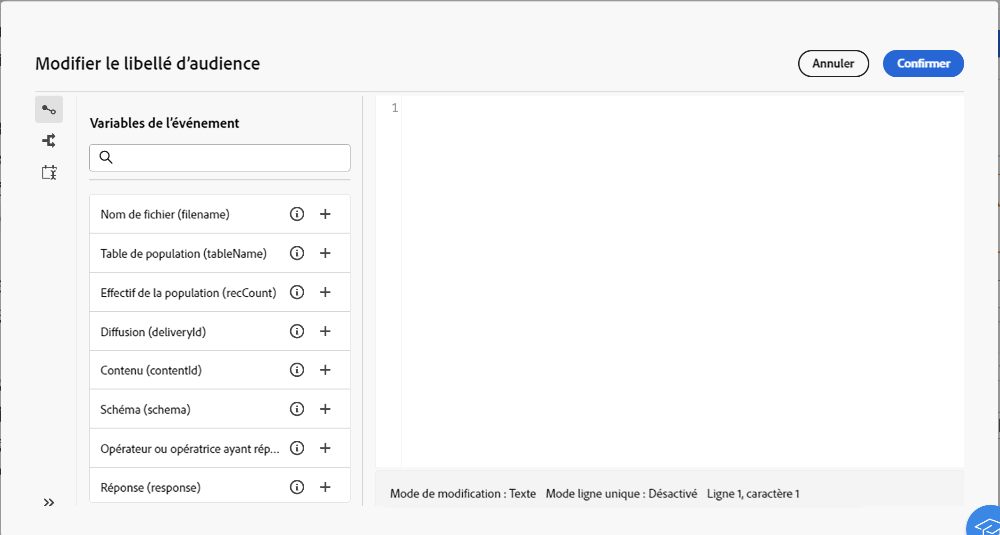

# Variables d’événement de workflow {#event-variables}

Certaines activités de workflow vous permettent de modifier des scripts dans l’éditeur d’expression afin d’effectuer des actions spécifiques, telles que récupérer des données provenant d’activités précédentes, créer des conditions ou calculer les noms de fichiers en fonction de variables d’événement.

## Quelles sont les variables d’événement ? {#scripting}

Les scripts exécutés dans le contexte d’un workflow accèdent à une série d’autres **objet** comme le workflow lui-même en cours d’exécution (`ìnstance`), ses différentes tâches (`task`) ou les événements qui ont activé une tâche donnée (`event`).

Pour chaque type de **objet** est associé à une catégorie de **variables** qui peuvent être utilisés dans l’éditeur d’expression lors de la modification de scripts dans des activités telles que **[!UICONTROL Code JavaScript]** ou **[!UICONTROL Test]**.

* **Variables d’instance** (`instance.vars.xxx`) sont comparables à des variables globales. Elles sont partagées par toutes les activités.
* **Variables de tâche** (`task.vars.xxx`) sont comparables à des variables locales. Ils ne sont utilisés que par la tâche en cours. Ces variables sont utilisées par des activités persistantes pour conserver des données et sont parfois utilisées pour exchange des données entre les différents scripts d’une même activité.
* **Variables d’événement** (`vars.xxx`) activer l’exchange des données entre les tâches élémentaires d’un processus de workflow. Ces variables sont transmises par la tâche qui a activé la tâche en cours. Elles sont ensuite transmises aux activités suivantes. **Variables d’événement** sont les variables les plus souvent utilisées et elles doivent être préférées aux variables d’instance.

>[!NOTE]
>
>Des informations supplémentaires sur les scripts et les objets et variables exposés dans Adobe Campaign sont disponibles dans la documentation de Campaign v8 (console cliente) dans [cette section](https://experienceleague.adobe.com/en/docs/campaign/automation/workflows/advanced-management/javascript-scripts-and-templates).
>
>Bien que cette ressource offre des informations précieuses, des incohérences peuvent exister dans la mesure où elle s&#39;applique spécifiquement à la console cliente plutôt qu&#39;à l&#39;interface utilisateur web de Campaign.

## Utilisation des variables d’événement dans l’éditeur d’expression {#expression-editor}

Les variables d’événements prédéfinies peuvent être utilisées dans le volet de gauche de l’éditeur d’expression. Vous pouvez également en créer de nouvelles en initialisant une nouvelle variable dans votre code.

Outre ces variables d’événement, vous pouvez également utiliser la variable **[!UICONTROL Conditions]** dans le volet de gauche pour créer des conditions et la variable **[!UICONTROL Ajouter la date actuelle]** pour utiliser les fonctions liées au formatage des dates.
