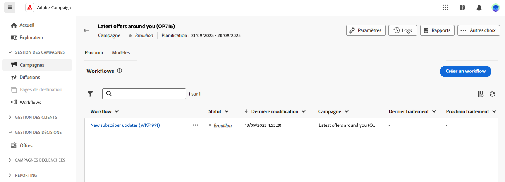

# Principes de base de la création de workflows {#gs-workflow-creation}

Avec Adobe Campaign Web, vous pouvez créer des workflows dans une zone de travail visuelle afin de concevoir des processus cross-canal tels que la segmentation, l’exécution de campagnes ou le traitement de fichiers.

## Quels sont les éléments d’un workflow ? {#gs-workflow-inside}

Le diagramme de workflow représente le processus planifié. Il décrit les différentes tâches à effectuer et la manière dont elles sont liées.

{zoomable="yes"}

Chaque workflow comprend :

* des **Activités** : une activité est une tâche à effectuer. Les icônes du diagramme représentent les différentes activités. Chaque activité possède des propriétés spécifiques et des propriétés communes à toutes les activités.

  Dans un diagramme de workflow, une même activité peut engendrer plusieurs tâches, notamment en cas de boucle ou d’actions récurrentes.

* **Transitions** : les transitions relient une activité source à une activité de destination et définissent leur ordre.

* **Tables de travail** : la table de travail contient toutes les informations véhiculées par la transition. Chaque workflow utilise plusieurs tables de travail. Les données transmises dans ces tableaux peuvent être utilisées tout au long du cycle de vie du workflow.

## Étapes essentielles pour créer un workflow {#gs-workflow-steps}

Les campagnes offrent deux manières de créer un workflow :

1. Les workflows peuvent être créés en tant que workflows autonomes à partir du menu **Workflows**.

   {zoomable="yes"}

1. Les workflows peuvent être créés directement dans une campagne, à partir de l’onglet **Workflow** de la campagne. Lorsqu’il est inclus dans une campagne, le workflow est exécuté avec tous les autres workflows de la campagne et les mesures de rapports sont toutes regroupées au niveau de la campagne.

   {zoomable="yes"}

Pour créer des workflows, procédez comme suit :

{zoomable="yes"}

Ces étapes sont détaillées dans les sections suivantes :

1. [Créer votre workflow et définir ses propriétés](create-workflow.md)
1. [Orchestrer et configurer des activités](orchestrate-activities.md)
1. [Configurer les paramètres avancés de votre workflow](workflow-settings.md)
1. [Démarrer votre workflow et surveiller son exécution](start-monitor-workflows.md)