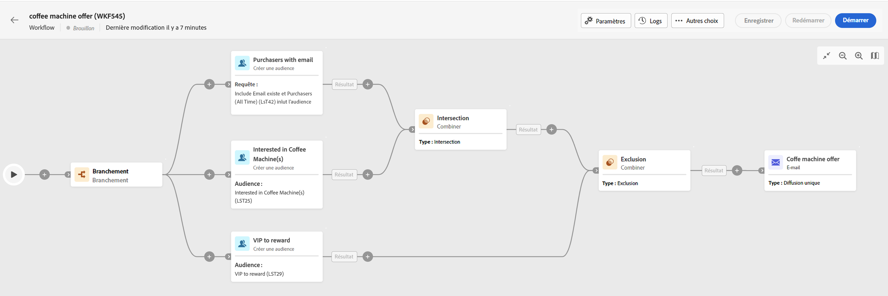

# Principes fondamentaux de la création de workflows {#gs-workflow-creation}

Avec Campaign v8 Web, vous pouvez créer des workflows dans une zone de travail visuelle afin de concevoir des processus cross-canal tels que la segmentation, l’exécution de campagnes ou le traitement de fichiers.

Les workflows peuvent être créés en tant que workflows autonomes, depuis le menu Workflows , ou directement au sein d&#39;une opération. Dans ce cas, le workflow sera associé à l&#39;opération et exécuté avec tous les workflows des autres opérations.

## Quels sont les éléments d’un workflow ?

Le diagramme de workflow est une représentation de ce qui est censé se produire. Il décrit les différentes tâches à effectuer et la manière dont elles sont liées.

Chaque workflow comprend :

* **Activities**: une activité est une tâche à effectuer. Les différentes activités disponibles sont représentées sur le diagramme par des icônes. Chaque activité possède des propriétés spécifiques et d’autres propriétés communes à toutes les activités.

  Dans un diagramme de workflow, une même activité peut engendrer plusieurs tâches, notamment en cas de boucle ou d’actions récurrentes.

* **Transitions** : les transitions relient une activité source à une activité de destination et définissent leur ordre.

* **Tables de travail** : la table de travail contient toutes les informations véhiculées par la transition. Chaque workflow utilise plusieurs tables de travail. Les données véhiculées dans ces tables peuvent être utilisées tout au long du cycle de vie du workflow.

## Procédure de création d’un workflow

Pour créer un workflow, procédez comme suit :

