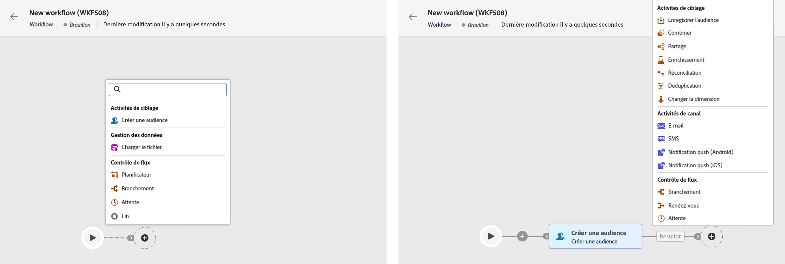
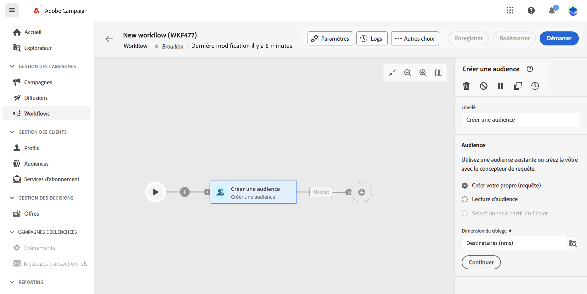
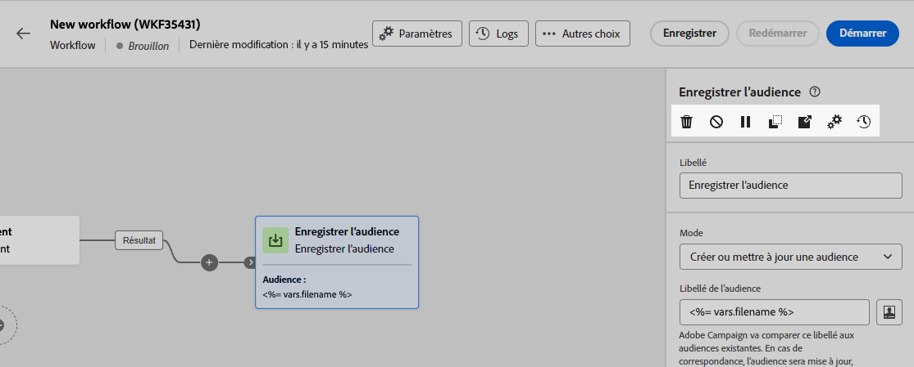

# Orchestrer les activités {#orchestrate}

Une fois que vous avez réussi à [créer un workflow](create-workflow.md), à partir du menu de workflow ou au sein d’une campagne, vous pouvez commencer à orchestrer les différentes tâches qu’il exécutera. Pour ce faire, une zone de travail visuelle dédiée vous permet de créer un diagramme de workflow. Dans ce diagramme, vous pouvez ajouter différentes activités et les enchaîner dans un ordre séquentiel.

## Ajouter des activités {#add}

À ce stade de la configuration, le diagramme comporte une icône de démarrage, qui représente le début de votre workflow. Pour ajouter votre première activité, cliquez sur le bouton **+** bouton connecté à l’icône de début.

La liste des activités pouvant être ajoutées au diagramme s’affiche. Les activités disponibles dépendent de votre position dans le diagramme de workflow. Par exemple, lors de l’ajout de votre première activité, vous pouvez démarrer votre workflow en ciblant une audience, en fractionnant le chemin du workflow ou en définissant un **Attente** pour retarder l&#39;exécution du workflow. D’un autre côté, après une **Créer une audience** activité, vous pouvez affiner votre cible avec des activités de ciblage, envoyer une diffusion à votre audience avec des activités de canal, ou organiser le processus de workflow avec des activités de contrôle de flux.

{zoomable=&quot;yes&quot;}

Une fois qu’une activité a été ajoutée au diagramme, un volet s’affiche à droite. Il vous permet de définir des paramètres spécifiques pour l’activité. Des informations détaillées sur la configuration de chacune des activités sont disponibles dans [cette section](activities/about-activities.md).

{zoomable=&quot;yes&quot;}

Répétez cette procédure pour ajouter autant d&#39;activités que vous le souhaitez en fonction des tâches que votre workflow doit exécuter. Vous pouvez également insérer une nouvelle activité entre deux activités. Pour ce faire, cliquez sur le bouton **+** sur la transition entre les activités, sélectionnez l&#39;activité souhaitée et configurez-la dans le volet de droite.

Pour supprimer une activité, sélectionnez-la dans la zone de travail, puis cliquez sur le bouton **Supprimer** dans les propriétés de l’activité.

>[!TIP]
>
>Vous pouvez personnaliser le nom des transitions entre chaque activité. Pour ce faire, sélectionnez la transition et modifiez son libellé dans le volet de droite.

## Gérer des activités {#manage}

Lors de l’ajout d’activités, des boutons d’action sont disponibles dans le panneau des propriétés, vous permettant d’effectuer plusieurs opérations. Vous pouvez ainsi :

* **Supprimer** l’activité à partir de la zone de travail.
* **Désactivez/activez** l’activité. Lorsque le workflow est exécuté, les activités désactivées et les activités qui suivent sur le même chemin ne sont pas exécutées et le workflow est arrêté.
* **Copiez** l’activité. Vous pouvez ensuite le coller dans n’importe quel workflow en cliquant sur le bouton **+** sur une transition et en sélectionnant &quot;Activité Coller 1&quot;.
* Accédez aux **Journaux et tâches** de l’activité.
* **Mettez en pause/Reprenez** l’activité. Lorsque le workflow est exécuté, il s’arrête quand l’activité est en pause. La tâche correspondante, ainsi que toutes les suivantes dans le même chemin, ne sont pas exécutées.

{zoomable=&quot;yes&quot;}{width="50%"}

## Exemple {#example}

Voici un exemple de workflow permettant d’envoyer un e-mail à l’ensemble de la clientèle (autres que les clients et clientes VIP) qui s’intéresse aux machines à café.

{zoomable=&quot;yes&quot;}{zoomable=&quot;yes&quot;}

Dans le cadre de ce workflow, les activités suivantes ont été ajoutées :

* une activité **[!UICONTROL Branchement]** qui divise le workflow en trois chemins (un pour chaque ensemble de clients et clientes)
* des activités **[!UICONTROL Créer une audience]** destinées à cibler les trois ensembles de clients et clientes :

   * les clients et clientes disposant d’une adresse e-mail
   * les clients et clientes appartenant à l’audience préexistante « Intéressés par la ou les machines à café »
   * les clients et clientes appartenant à l’audience préexistante « VIP ou récompense »

* une activité **[!UICONTROL Combiner]** qui regroupe les clients et clientes disposant d’une adresse e-mail et ceux ou celles intéressés par les machines à café
* une activité **[!UICONTROL Combiner]** qui exclut les clients et clientes VIP
* une activité **[!UICONTROL Diffusion e-mail]** qui envoie un e-mail aux clients et clientes correspondants

Une fois le workflow terminé, ajoutez l’activité **[!UICONTROL Fin]** à la fin du diagramme. Cette activité permet d’illustrer la fin d’un workflow et n’a aucun impact sur celui-ci.

Une fois le diagramme de workflow conçu, vous pouvez l’exécuter et suivre la progression des différentes tâches. [Découvrez comment démarrer un workflow et surveiller son exécution.](start-monitor-workflows.md)
