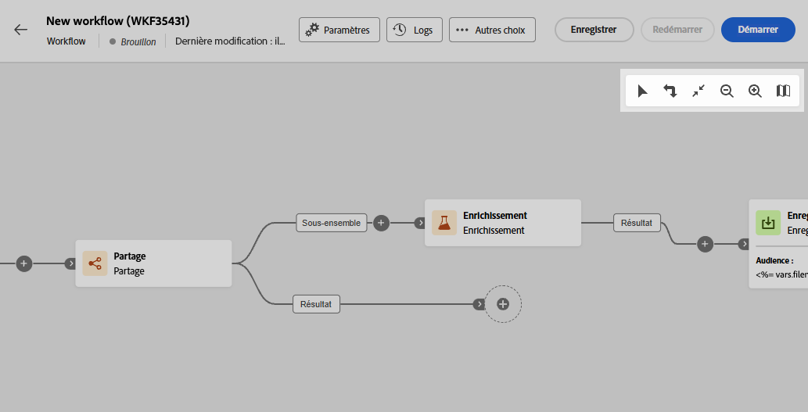
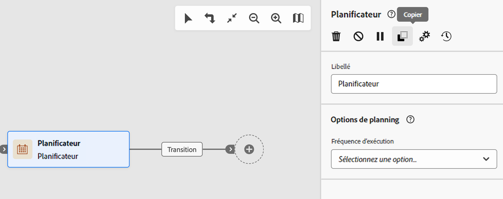
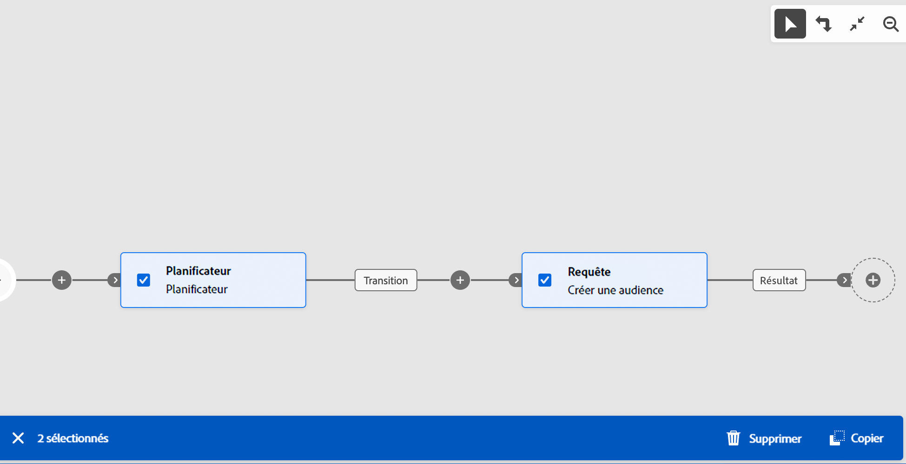
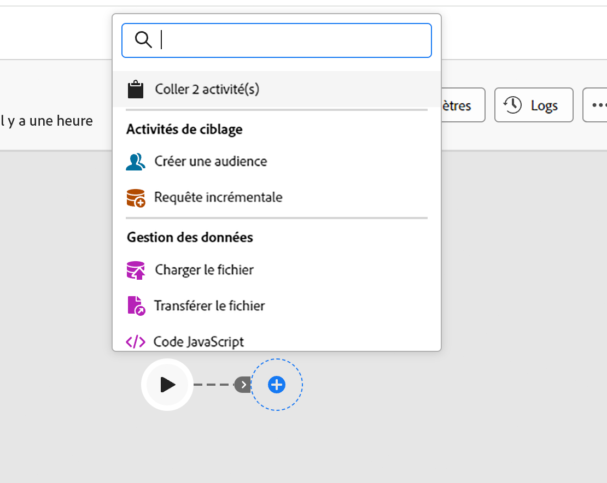
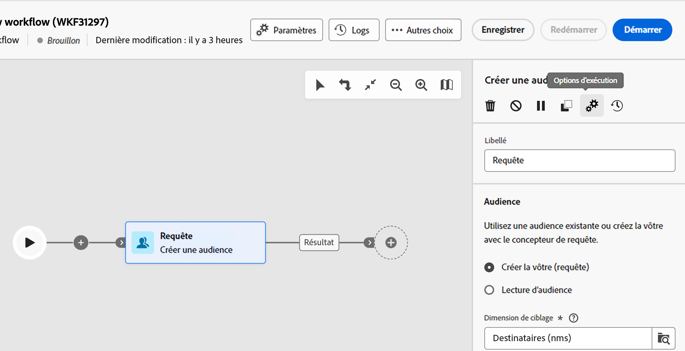

# Orchestrer les activités {#orchestrate}

Une fois que vous avez réussi à [créer un workflow](create-workflow.md), à partir du menu de workflow ou au sein d’une campagne, vous pouvez commencer à orchestrer les différentes tâches qu’il exécutera. Pour ce faire, une zone de travail visuelle dédiée vous permet de créer un diagramme de workflow. Dans ce diagramme, vous pouvez ajouter différentes activités et les enchaîner dans un ordre séquentiel.

## Ajouter des activités {#add}

À ce stade de la configuration, le diagramme comporte une icône de démarrage, qui représente le début de votre workflow. Pour ajouter votre première activité, cliquez sur le bouton **+** associé à l’icône de démarrage.

La liste des activités pouvant être ajoutées au diagramme s’affiche. Les activités disponibles dépendent de votre position dans le diagramme de workflow. Par exemple, lorsque vous ajoutez votre première activité pour démarrer votre workflow, vous pouvez cibler une audience, fractionner le chemin du workflow ou définir une activité **Attente** pour retarder l’exécution du workflow. D’un autre côté, après une **Créer une audience** activité, vous pouvez affiner votre cible avec des activités de ciblage, envoyer une diffusion à votre audience avec des activités de canal ou organiser le processus de workflow avec des activités de contrôle de flux.

{zoomable=&quot;yes&quot;}

Une fois qu’une activité a été ajoutée au diagramme, un volet s’affiche à droite. Il vous permet de définir des paramètres spécifiques pour l’activité. Des informations détaillées sur la configuration de chacune des activités sont disponibles dans [cette section](activities/about-activities.md).

{zoomable=&quot;yes&quot;}

Répétez cette procédure pour ajouter autant d&#39;activités que vous le souhaitez en fonction des tâches que votre workflow doit réaliser. Vous pouvez également insérer une nouvelle activité entre deux activités. Pour ce faire, cliquez sur le bouton **+** sur la transition entre les activités, puis sélectionnez l’activité souhaitée et configurez-la dans le volet de droite.

Pour supprimer une activité, sélectionnez-la dans la zone de travail et cliquez sur l’icône **Supprimer** dans les propriétés de l’activité.

>[!TIP]
>
>Vous pouvez personnaliser le nom des transitions entre chaque activité. Pour ce faire, sélectionnez la transition et modifiez son libellé dans le volet de droite.

## Barre d’outils {#toolbar}

La barre d’outils située dans le coin supérieur droit de la zone de travail fournit des options pour manipuler facilement les activités et naviguer dans la zone de travail :

* **Mode de sélection multiple**: sélectionnez plusieurs activités pour les supprimer toutes en même temps ou copiez-les et collez-les. Consultez [cette section](#copy).
* **Faire pivoter** : retournez la zone de travail verticalement.
* **Ajuster à l’écran** : adaptez le niveau de zoom de la zone de travail à votre écran.
* **Zoom arrière**/**Zoom avant** : effectuez un zoom arrière ou avant dans la zone de travail.
* **Afficher la carte** : ouvre un instantané de la zone de travail indiquant où vous vous trouvez.

{zoomable=&quot;yes&quot;}{width="50%"}

## Gérer des activités {#manage}

Lors de l’ajout d’activités, des boutons d’action sont disponibles dans le volet des propriétés, ce qui vous permet d’effectuer plusieurs opérations. Vous pouvez ainsi :

* **Supprimer** l’activité à partir de la zone de travail.
* **Désactivez/activez** l’activité. Lorsque le workflow est exécuté, les activités désactivées et les activités qui suivent sur le même chemin ne sont pas exécutées et le workflow est arrêté.
* **Copiez** l’activité. Consultez [cette section](#copy).
* Accédez aux **Journaux et tâches** de l’activité.
* **Mettez en pause/Reprenez** l’activité. Lorsque le workflow est exécuté, il s’arrête quand l’activité est en pause. La tâche correspondante, ainsi que toutes les suivantes dans le même chemin, ne sont pas exécutées.

{zoomable=&quot;yes&quot;}{width="50%"}

Plusieurs activités de **Ciblage**, telles que **Combiner** ou **Déduplication**, vous permettent de traiter la population restante et de l’inclure dans une transition de sortie supplémentaire. Par exemple, si vous utilisez une activité **Partage**, le complément est constitué de la population qui ne correspond à aucun des sous-ensembles définis précédemment. Pour utiliser cette fonctionnalité, activez l’option **Générer le complément**.

## Copie d’activités {#copy}

Vous pouvez copier des activités de workflow et les coller dans n’importe quel workflow. Le workflow de destination peut se trouver dans un autre onglet du navigateur.

Pour copier des activités, vous avez deux possibilités :

* copiez une activité à l&#39;aide du bouton d&#39;action.

  {zoomable=&quot;yes&quot;}{width="70%"}

* copier plusieurs activités à l’aide du bouton de la barre d’outils.

  {zoomable=&quot;yes&quot;}{width="70%"}

Pour coller les activités copiées, cliquez sur le **+** sur une transition et sélectionnez &quot;Coller X activité&quot;.

{zoomable=&quot;yes&quot;}{width="50%"}

## Options d’exécution {#execution}

Toutes les activités permettent de gérer les options d&#39;exécution. Sélectionnez une activité et cliquez sur le bouton **Options d&#39;exécution** bouton . Vous pouvez ainsi définir le mode d&#39;exécution et le comportement de l&#39;activité en cas d&#39;erreur.

{zoomable=&quot;yes&quot;}{width="70%"}

### Propriétés

La variable **Exécution** vous permet de définir l’action à effectuer au moment du démarrage de la tâche.

La variable **Durée maximale d’exécution** vous permet de spécifier une durée telle que &quot;30s&quot; ou &quot;1h&quot;. Si l’activité n’est pas terminée une fois cette durée écoulée, une alerte est déclenchée, ce qui n’a par ailleurs aucun impact sur le fonctionnement du workflow.

Le champ **Fuseau horaire** vous permet de sélectionner le fuseau horaire de l’activité. Adobe Campaign permet de gérer les décalages horaires entre plusieurs pays concernés par la même instance. La configuration appliquée est paramétrée lors de la création de l’instance.

**L&#39;affinité** vous permet de forcer l’exécution d’un workflow ou d’une activité de workflow sur une machine en particulier. Vous devez pour cela définir une ou plusieurs affinités au niveau du workflow ou de l’activité concernée.

La variable **Comportement** vous permet de définir la procédure à suivre en cas d’utilisation de tâches asynchrones.

### Gestion des erreurs       

La variable **En cas d’erreur** vous permet de spécifier l’action à effectuer lorsque l’activité rencontre une erreur.

### Script d’initialisation

La variable **Script d&#39;initialisation** vous permet d’initialiser des variables ou de modifier les propriétés de l’activité. Cliquez sur le bouton **Modifier le code** et saisissez le fragment de code à exécuter. Le script est appelé lors de l’exécution de l’activité. Consultez la section relative à la [variables d&#39;événements](../workflows/event-variables.md).

## Exemple {#example}

Voici un exemple de workflow permettant d’envoyer un e-mail à l’ensemble de la clientèle (autres que les clientes et clients VIP) qui s’intéresse aux machines à café.

{zoomable=&quot;yes&quot;}{zoomable=&quot;yes&quot;}

Dans le cadre de ce workflow, les activités suivantes ont été ajoutées :

* une activité **[!UICONTROL Branchement]** qui divise le workflow en trois chemins (un pour chaque ensemble de clients et clientes)
* des activités **[!UICONTROL Créer une audience]** destinées à cibler les trois ensembles de clients et clientes :

   * les clients et clientes disposant d’une adresse e-mail
   * les clients et clientes appartenant à l’audience préexistante « Intéressés par la ou les machines à café »
   * les clients et clientes appartenant à l’audience préexistante « VIP ou récompense »

* une activité **[!UICONTROL Combiner]** qui regroupe les clients et clientes disposant d’une adresse e-mail et ceux ou celles intéressés par les machines à café
* une activité **[!UICONTROL Combiner]** qui exclut les clients et clientes VIP
* une activité **[!UICONTROL Diffusion e-mail]** qui envoie un e-mail aux clients et clientes correspondants

Une fois le workflow terminé, ajoutez l’activité **[!UICONTROL Fin]** à la fin du diagramme. Cette activité permet d’illustrer la fin d’un workflow et n’a aucun impact sur celui-ci.

Une fois le diagramme de workflow conçu, vous pouvez l’exécuter et suivre la progression des différentes tâches. [Découvrez comment démarrer un workflow et surveiller son exécution.](start-monitor-workflows.md)
