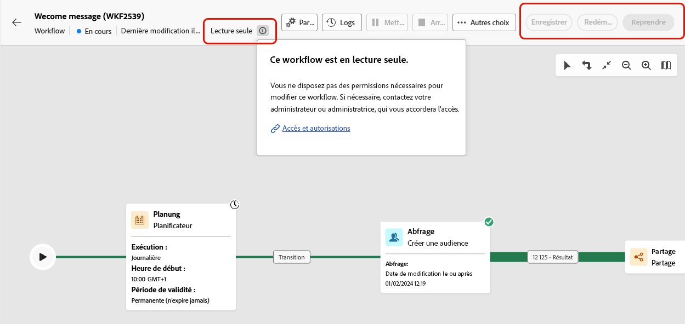
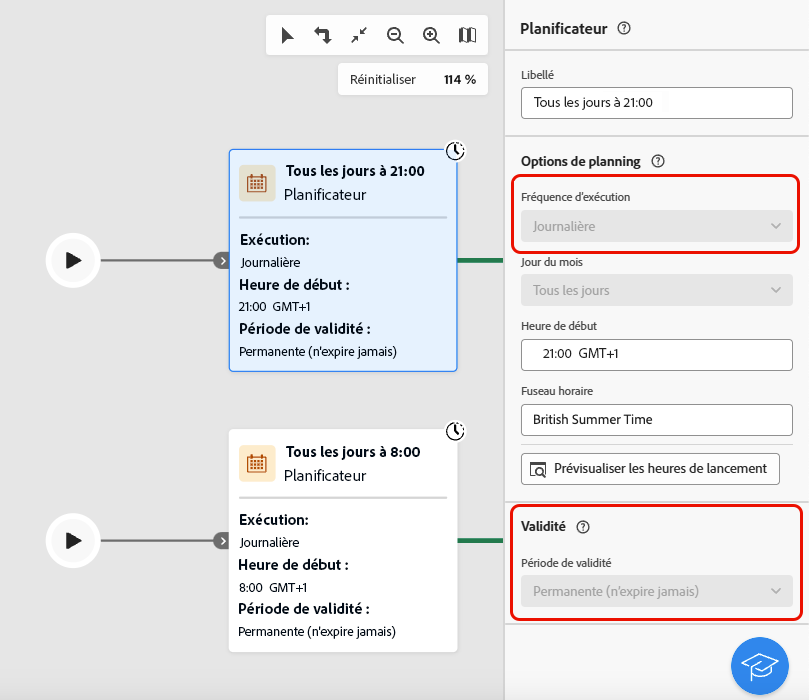
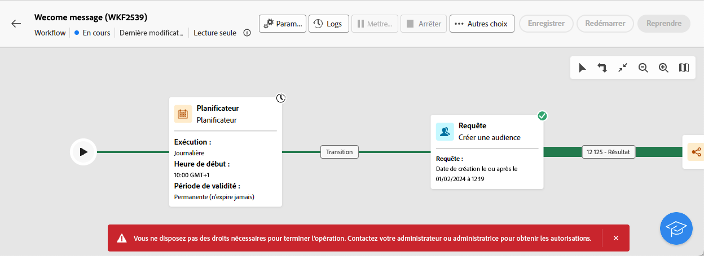
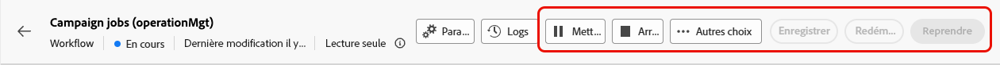

# À propos des workflows en lecture seule {#readonly-workflows}

>[!CONTEXTUALHELP]
>
Certains workflows sont en lecture seule. Les workflows techniques natifs sont toujours en lecture seule, mais cette restriction peut également s’appliquer à d’autres types de workflows.

Les utilisateurs de Campaign peuvent avoir un accès restreint aux données d’Adobe Campaign. Un administrateur Campaign peut lui accorder le droit d&#39;afficher certaines fonctionnalités, mais pas de les modifier. Les autorisations utilisateur/utilisatrice sur les données sont essentielles pour assurer la sécurité des données et des processus. En savoir plus sur la gestion des autorisations dans Campaign dans [cette section](../get-started/permissions.md).

Lorsqu’un workflow est en mode lecture seule :

* La mention **[!UICONTROL Lecture seule]** apparaît près du bouton **[!UICONTROL Paramètres]**.
* Les boutons d’action ne sont pas accessibles.

{zoomable="yes"}

Il est impossible de modifier quoi que ce soit dans un workflow en lecture seule. Ils ne sont pas autorisés à modifier les paramètres des activités.

{zoomable="yes"}

Les utilisateurs ne peuvent pas supprimer le workflow.

{zoomable="yes"}

## Types de workflows en lecture seule {#readonly-workflow-types}

Selon le type de workflow, le mode lecture seule peut varier.

### Les workflows de campagne {#readonly-campaign-wf}

Dans un workflow de campagne en lecture seule, l’utilisateur ne peut pas accéder au bouton de surveillance.

{zoomable="yes"}

### Workflows techniques {#readonly-tech-wf}

Les workflows techniques natifs sont en lecture seule pour tous les utilisateurs de Campaign, y compris les administrateurs. L’utilisateur ou l’utilisatrice peut toutefois les mettre en **pause** ou les **arrêter** si nécessaire. Il s’agit des seules actions autorisées.

{zoomable="yes"}

En savoir plus sur les workflows techniques dans [cette section](https://experienceleague.adobe.com/fr/docs/campaign/automation/workflows/introduction/wf-type/technical-workflows).