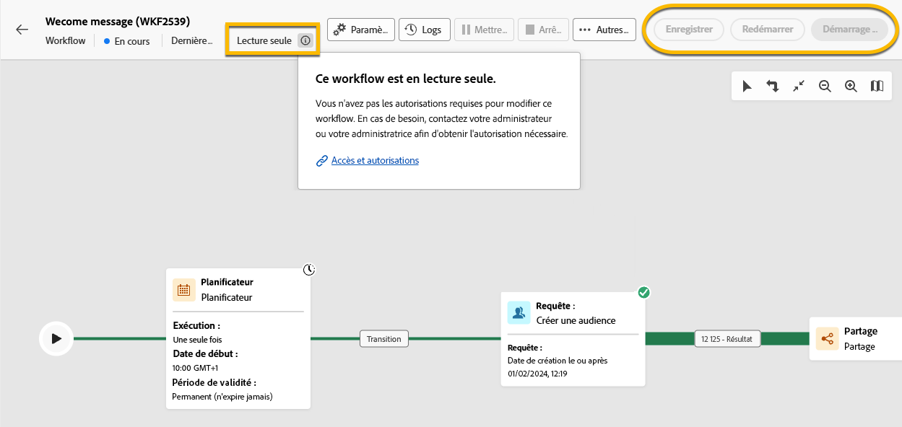
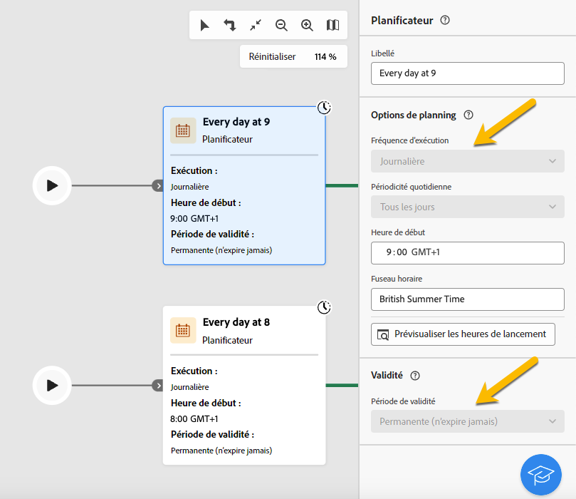
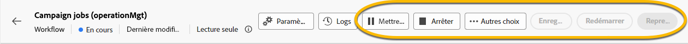

# A propos des workflows en lecture seule {#readonly-workflows}

>[!CONTEXTUALHELP]
>id="acw_wf_read_only_canvas"
>title="Ce workflow est en lecture seule."
>abstract="Vous ne pouvez pas modifier ce workflow en raison de vos droits ou du type de workflow."

Certains workflows peuvent être en lecture seule. Vous pouvez le voir avec :

- La mention **[!UICONTROL ** Lecture seule **]**  à proximité du **[!UICONTROL Paramètres]** button
- Les boutons d’action ne sont pas accessibles

{zoomable="yes"}

Vous ne pouvez rien modifier dans un workflow en lecture seule. Vous n’êtes pas autorisé à modifier les paramètres des activités.

{zoomable="yes"}

Vous ne disposez pas non plus des droits nécessaires pour supprimer le workflow.

{zoomable="yes"}

## Pourquoi les workflows en lecture seule

Le mode Lecture seule est destiné aux utilisateurs qui ne disposent pas de droits d’accès et d’autorisation pour modifier ces workflows. [En savoir plus ici](../get-started/permissions.md)

Un utilisateur de campagne peut avoir des restrictions sur les données auxquelles il peut accéder dans Adobe Campaign. L&#39;administrateur peut lui donner la possibilité d&#39;afficher certaines fonctionnalités mais de ne pas les utiliser.

## Types de workflows en lecture seule

Selon le type de workflow, le mode lecture seule peut être différent.

### Les workflows de campagne

Dans le cas d&#39;un workflow de campagne en lecture seule, l&#39;utilisateur ne peut pas accéder au bouton de surveillance.

{zoomable="yes"}

### Workflows techniques

Les workflows techniques sont en lecture seule pour les utilisateurs de la campagne.
Les workflows techniques intégrés sont en lecture seule pour tous, même pour les utilisateurs administrateurs. Mais l’utilisateur peut **pause** ou **stop** si nécessaire. Ce sont les seules actions autorisées. [En savoir plus ici](https://experienceleague.adobe.com/en/docs/campaign/automation/workflows/introduction/wf-type/technical-workflows)

{zoomable="yes"}