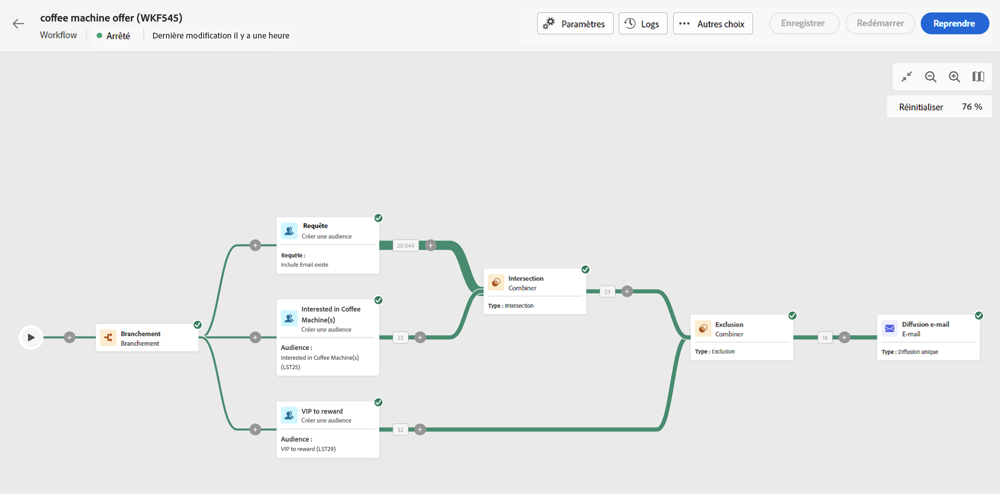
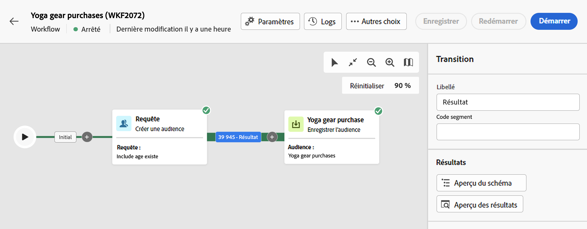
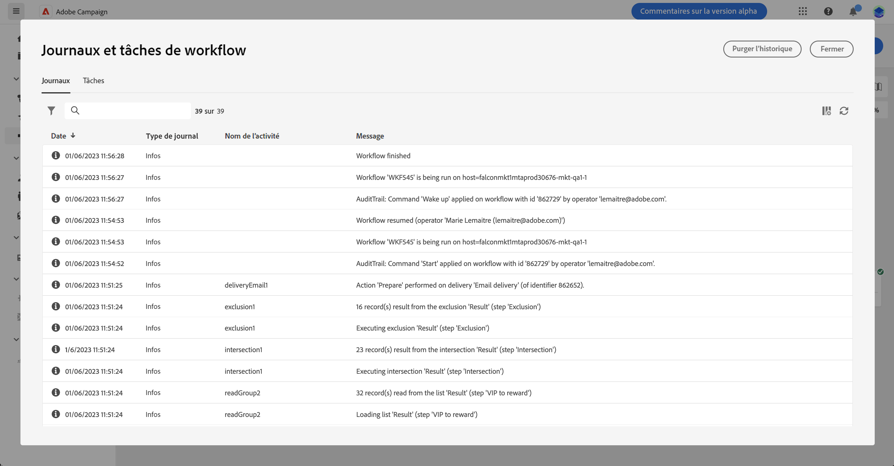

# Démarrer et surveiller vos workflows {#start-monitor}

Une fois que vous avez créé votre workflow et conçu les tâches à effectuer dans la zone de travail, vous pouvez lancer et contrôler son exécution.

## Démarrer le workflow {#start}

Pour démarrer le workflow, accédez au menu **[!UICONTROL Workflows]** ou à la campagne associée, puis cliquez sur le bouton **[!UICONTROL Démarrer]** dans le coin supérieur droit de la zone de travail.

Une fois le workflow en cours d’exécution, chaque activité de la zone de travail est exécutée dans un ordre séquentiel, jusqu’à ce que le workflow soit terminé.

Vous pouvez suivre la progression des profils ciblés en temps réel à l’aide du flux visuel. Vous pouvez ainsi identifier rapidement le statut de chaque activité et le nombre de profils qu’elle contient.

{zoomable="yes"}

## Transitions de workflow {#transitions}

Dans les workflows, les données véhiculées d’une activité à l’autre via les transitions sont stockées dans une table de travail temporaire. Ces données peuvent être affichées pour chaque transition. Pour afficher les données, sélectionnez une transition pour ouvrir ses propriétés dans la partie droite de l’écran.

* Cliquez sur **[!UICONTROL Aperçu du schéma]** pour afficher le schéma de la table de travail.
* Cliquez sur **[!UICONTROL Aperçu des résultats]** pour visualiser les données véhiculées dans la transition sélectionnée.

{zoomable="yes"}

## Surveiller l’exécution des activités {#activities}

Les indicateurs visuels situés dans le coin supérieur droit de chaque activité vous permettent de vérifier leur statut d’exécution :

| Indicateur visuel | Description |
|------------------|-------------|
| {zoomable="yes"}{width="70%"} | L’activité est en cours d’exécution. |
| {zoomable="yes"}{width="70%"} | L’activité nécessite votre attention. Vous devez, par exemple, confirmer l’envoi d’une diffusion ou prendre une mesure nécessaire. |
| {zoomable="yes"}{width="70%"} | L’activité a rencontré une erreur. Pour résoudre ce problème, ouvrez les logs de workflow pour obtenir plus d’informations. |
| {zoomable="yes"}{width="70%"} | L’activité a été exécutée correctement. |

## Surveiller les logs et les tâches {#logs-tasks}

La surveillance des logs et des tâches de workflow est une étape essentielle pour analyser vos workflows et vérifier qu’ils s’exécutent correctement. Les logs et les tâches sont accessibles à partir de l’icône **[!UICONTROL Logs]**, située dans la barre d’outils d’actions et dans le volet des propriétés de chaque activité.

Le menu **[!UICONTROL Logs et tâches]** fournit un historique de l’exécution du workflow : il consigne toutes les actions de l’utilisateur ou de l’utilisatrice, ainsi que les erreurs rencontrées. L’historique est conservé pendant la durée indiquée dans les [options d’exécution](workflow-settings.md) du workflow. Pendant cette durée, tous les messages sont conservés, même après un redémarrage du workflow. Si vous ne souhaitez pas conserver les messages d’une exécution précédente, cliquez sur le bouton **[!UICONTROL Purger l’historique]**.

{zoomable="yes"}

Deux types d’informations sont disponibles :

* L’onglet **[!UICONTROL Log]** affiche l’historique de l’exécution de toutes les activités du workflow. Il répertorie par ordre chronologique les opérations réalisées et les erreurs d’exécution.
* L’onglet **[!UICONTROL Tâches]** permet de voir le séquencement de l’exécution des activités.

Sous les deux onglets, vous pouvez choisir les colonnes à afficher et leur ordre, appliquer des filtres et trouver rapidement des informations à l’aide du champ de recherche.

## Commandes d’exécution du workflow {#execution-commands}

La barre d’actions située dans le coin supérieur droit propose des commandes dédiées à la gestion de l’exécution du workflow. Vous pouvez ainsi :

* **[!UICONTROL Démarrer]** / **[!UICONTROL Reprendre]** l’exécution du workflow. Si le workflow était en pause, il reprend. Sinon, il démarre et les activités initiales sont activées.
* **[!UICONTROL Mettre en pause]** l’exécution du workflow. Le workflow adopte alors le statut En pause. Aucune nouvelle activité n’est activée jusqu’à la prochaine reprise, mais les opérations en cours ne sont pas suspendues.
* **[!UICONTROL Arrêter]** un workflow en cours d’exécution. Le workflow adopte alors le statut Terminé. Les opérations en cours sont interrompues, si possible. Il n’est pas possible de reprendre à l’endroit où le workflow s’est arrêté.