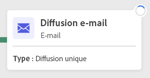
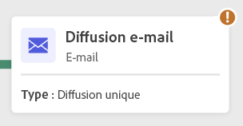
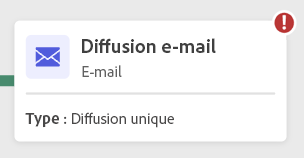
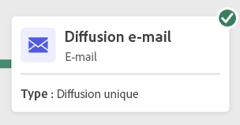

# Démarrer et surveiller l’exécution des workflows {#start-monitor}

Une fois que vous avez créé votre workflow et conçu les tâches à effectuer dans la zone de travail, vous pouvez le lancer et contrôler son exécution.

## Démarrez le workflow. {#start}

Pour démarrer le workflow, ouvrez-le depuis le menu Workflows ou l&#39;opération associée, puis cliquez sur le bouton Démarrer dans le coin supérieur droit de la zone de travail.

Une fois le workflow en cours d’exécution, chaque activité de la zone de travail est exécutée dans un ordre séquentiel, jusqu’à ce que la fin du workflow soit atteinte.

Vous pouvez suivre en temps réel la progression des profils ciblés dans le workflow grâce à un flux visuel. Vous pouvez ainsi identifier rapidement l’état de chaque activité et le nombre de profils qui naviguent sur chaque transition.

>[!NOTE]
>
>Vous pouvez désactiver le flux visuel à l’aide du bouton Masquer la progression dans la barre d’outils supérieure de la zone de travail.

## Surveiller l’exécution des activités {#activities}

Les indicateurs visuels situés dans le coin supérieur droit de chaque activité vous permettent de vérifier leur exécution :

| Indicateur visuel | Description |
|-----|------------|
|  | L&#39;activité est en cours d&#39;exécution. |
|  | L’activité nécessite votre attention. Certaines actions peuvent être nécessaires, comme par exemple confirmer l&#39;envoi d&#39;une diffusion. |
|  | L’activité a rencontré une erreur. Ouvrez les logs de workflow pour obtenir plus d’informations et résoudre le problème. |
|  | L’activité a été exécutée avec succès. |

## Surveiller les journaux et les tâches

## Mettre en pause et arrêter un workflow

* Mettre le workflow en pause ou l’arrêter. Reprendre un workflow après l’avoir mis en pause.