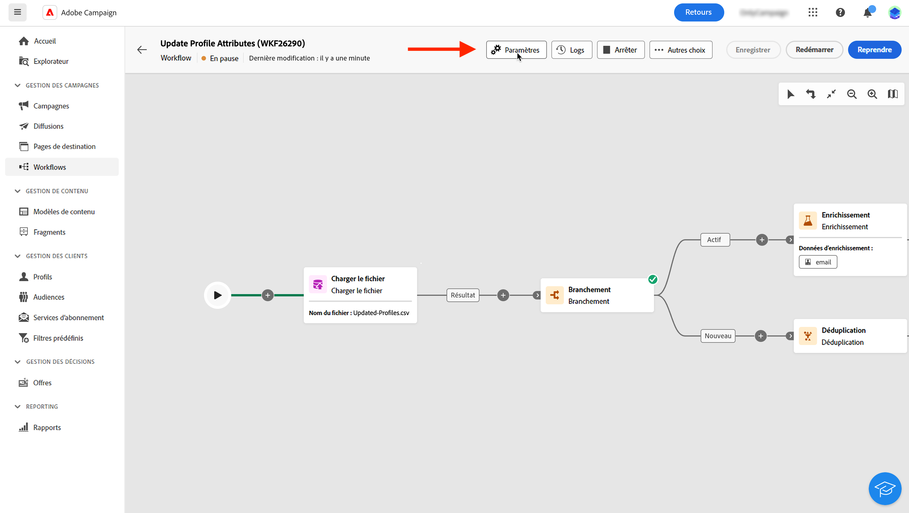

# Configurer les paramètres de workflow {#workflow-settings}

>[!CONTEXTUALHELP]
>id="acw_workflow_creation_properties"
>title="Propriétés du workflow"
>abstract="Dans cet écran, choisissez le modèle à utiliser pour créer le workflow et indiquez un libellé. Développez la section **Options supplémentaires** pour configurer d’autres paramètres, tels que le nom interne du workflow, son dossier, son fuseau horaire et son groupe de superviseurs. Il est vivement recommandé de sélectionner un groupe de personnes responsables afin d’alerter les opérateurs et opératrices en cas d’erreur."

Lors de la création d’un workflow ou de l’orchestration des activités de workflow dans la zone de travail, accédez aux paramètres avancés du workflow. Par exemple, définissez un fuseau horaire spécifique pour le workflow, gérez le comportement du workflow en cas d’erreur ou gérez le délai après lequel l’historique du workflow est purgé.

Ces paramètres sont prédéfinis dans le modèle sélectionné lors de la création du workflow, mais peuvent être modifiés selon les besoins du workflow.

{zoomable="yes"}{width="70%" align="left"}

## Propriétés de workflow  {#properties}

>[!CONTEXTUALHELP]
>id="acw_workflow_settings_properties"
>title="Propriétés de workflow "
>abstract="Cette section fournit des propriétés de workflow génériques, qui sont également accessibles lors de la création du workflow. Vous pouvez choisir le modèle à utiliser pour créer le workflow et indiquer un libellé. Développez la section Options supplémentaires pour configurer des paramètres spécifiques, tels que le dossier de stockage du workflow ou le fuseau horaire."

La section **[!UICONTROL Propriétés]** fournit des paramètres génériques qui peuvent être configurés lors de la création d’un workflow. Pour accéder aux propriétés d’un workflow existant, cliquez sur le bouton **[!UICONTROL Paramètres]** situé dans la barre d’actions qui se trouve au-dessus de la zone de travail du workflow.

{zoomable="yes"}{width="70%" align="left"}

Ces propriétés sont les suivantes :

* Le **[!UICONTROL libellé]** du workflow qui s’affiche dans la liste.
* Le **[!UICONTROL nom interne]** du workflow.
* Le **[!UICONTROL dossier]** dans lequel le workflow doit être enregistré.
* Le **[!UICONTROL fuseau horaire]** par défaut à utiliser dans toutes les activités du workflow. Par défaut, le fuseau horaire du workflow est celui défini pour l’opérateur Campaign actuel.
Les valeurs possibles sont les suivantes :
   * **Fuseau horaire du serveur** pour utiliser le fuseau horaire du serveur applicatif Adobe Campaign.
   * **Fuseau horaire de l’opérateur** pour utiliser le fuseau horaire de l’opérateur Adobe Campaign qui exécute le workflow, tel que défini dans le profil de l’opérateur dans la console cliente.
   * **Fuseau horaire de la base de données** pour utiliser le fuseau horaire du serveur de la base de données.
   * Fuseau horaire spécifique.
* Lorsqu’un workflow échoue, les opérateurs et opératrices appartenant au groupe d’opérateurs sélectionné dans le champ **[!UICONTROL Superviseur(s)]** sont avertis par e-mail.
* Saisissez une **[!UICONTROL Description]** de votre workflow.

Lorsque le workflow est [associé à une campagne](create-workflow.md), il est affiché dans le champ **[!UICONTROL Campagne liée]**. Ouvrez la campagne associée à partir de ce champ.

## Paramètres de segmentation {#segmentation-settings}

>[!CONTEXTUALHELP]
>id="acw_workflow_settings_segmentation"
>title="Paramètres de segmentation"
>abstract="Dans cette section, vous pouvez sélectionner la dimension de ciblage pour cibler les profils dans le workflow et choisir de conserver les résultats du workflow entre deux exécutions. Cette option ne doit être utilisée qu’à des fins de test. Elle ne doit en aucun cas être activée dans un workflow de production."

* **[!UICONTROL Dimension de ciblage]** : sélectionnez la dimension de ciblage à utiliser pour cibler les profils tels que les destinataires, les bénéficiaires d’un contrat, les opérateurs, les abonnés, etc. [Découvrez les dimensions de ciblage](../audience/targeting-dimensions.md).

* **[!UICONTROL Conserver le résultat des populations intermédiaires entre deux exécutions]** : par défaut, seules les tables de travail de la dernière exécution du workflow sont conservées. Les tables de travail des exécutions précédentes sont purgées par un workflow technique qui s’exécute tous les jours.

  Si cette option est activée, les tables de travail sont conservées même après l’exécution du workflow. Utilisez-le à des fins de test et assurez-vous qu’il est utilisé **uniquement** dans les environnements de développement ou d’évaluation. Cette option ne doit jamais être activée dans un workflow de production.

## Paramètres d&#39;exécution {#exec-settings}

>[!CONTEXTUALHELP]
>id="acw_workflow_settings_execution"
>title="Paramètres d&#39;exécution"
>abstract="Dans cette section, vous pouvez configurer les paramètres liés à l’exécution du workflow, tels que le nombre de jours pendant lesquels l’historique du workflow est conservé."

* **[!UICONTROL Jours d’historique]** : indique le nombre de jours après lesquels l’historique doit être purgé. L’historique contient des éléments liés au workflow, tels que des logs, des tâches et des événements (objets techniques liés à l’opération du workflow). La valeur par défaut est de 30 jours pour les modèles de workflow prêts à l’emploi. La purge de l’historique est effectuée par le workflow technique Nettoyage de la base de données , qui est exécuté tous les jours.

  >[!IMPORTANT]
  >
  >Si le champ **[!UICONTROL Jours d’historique]** n’est pas renseigné, la valeur prise en compte est « 1 », ce qui signifie que l’historique sera purgé après 1 jour.

* **[!UICONTROL Affinité par défaut]** : si votre installation comprend plusieurs serveurs de workflow, ce champ permet de spécifier le serveur sur lequel le workflow sera exécuté. Cela force l’exécution de ce workflow sur un serveur particulier. Choisissez un nom d&#39;affinité existant, mais assurez-vous de ne pas utiliser d&#39;espaces ou de signes de ponctuation. Si vous utilisez des serveurs différents, indiquez des noms différents séparés par des virgules.

  >[!IMPORTANT]
  >
  >Si la valeur définie dans ce champ n’existe sur aucun serveur, le workflow reste en attente.

* **[!UICONTROL Enregistrer les requêtes SQL dans le journal]** : cochez cette option pour enregistrer les requêtes SQL du workflow dans les journaux. Cette fonctionnalité est réservée aux utilisateurs et utilisatrices avancés. Elle s’applique aux workflows qui contiennent des activités de ciblage, comme **[!UICONTROL Créer une audience]**. Lorsque cette option est activée, les requêtes SQL envoyées à la base de données lors de l’exécution du workflow sont affichées dans les logs du workflow, ce qui vous permet de les analyser afin d’optimiser les requêtes ou de diagnostiquer les problèmes.

## Paramètres de gestion des erreurs {#error-settings}

>[!CONTEXTUALHELP]
>id="acw_workflow_settings_error"
>title="Paramètres de gestion des erreurs"
>abstract="Dans cette section, vous pouvez définir comment le workflow doit gérer les erreurs lors de son exécution. Vous pouvez choisir de suspendre le processus, d’ignorer un certain nombre d’erreurs ou d’arrêter l’exécution du workflow."

* **[!UICONTROL Gestion des erreurs]** : ce champ vous permet de définir les actions à effectuer si une tâche de workflow rencontre une erreur. Trois choix s’offrent à vous :

   * **[!UICONTROL Suspendre le processus]** : le workflow est automatiquement mis en pause et adopte le statut **[!UICONTROL Échec]**. Une fois le problème résolu, reprenez l’exécution du workflow à l’aide des boutons **[!UICONTROL Reprendre]**.
   * **[!UICONTROL Ignorer]** : le statut de la tâche qui a déclenché l’erreur passe à **[!UICONTROL Échec]**, mais le workflow conserve le statut **[!UICONTROL Démarré]**.<!-- TO ADD ONCE SCHEDULER IS AVAILABLE This configuration is relevant for recurring tasks: if the branch includes a scheduler, it will start normally next time the workflow is executed.-->
   * **[!UICONTROL Abandonner le processus]** : le workflow est automatiquement arrêté et adopte le statut **[!UICONTROL Échec]**. Une fois le problème résolu, redémarrez le workflow à l’aide du bouton **[!UICONTROL Démarrer]**.

* **[!UICONTROL Erreurs consécutives]** : ce champ est disponible lorsque la valeur **[!UICONTROL Ignorer]** est sélectionnée dans le champ **[!UICONTROL En cas d’erreur]**. Indiquez le nombre d’erreurs qui peuvent être ignorées avant l’arrêt du processus. Une fois ce nombre atteint, le statut du workflow passe à **[!UICONTROL Échec]**. Si la valeur de ce champ est 0, le workflow ne sera jamais arrêté, quel que soit le nombre d’erreurs.

## Script d’initialisation {#initialization-script}

Ce **script d’initialisation** vous permet d’initialiser des variables ou de modifier des propriétés d’activité. Cliquez sur le bouton **Modifier le code** et saisissez l’extrait de code à exécuter. Le script est appelé lors de l’exécution du workflow. Consultez la section relative aux [variables d’événement](../workflows/event-variables.md).