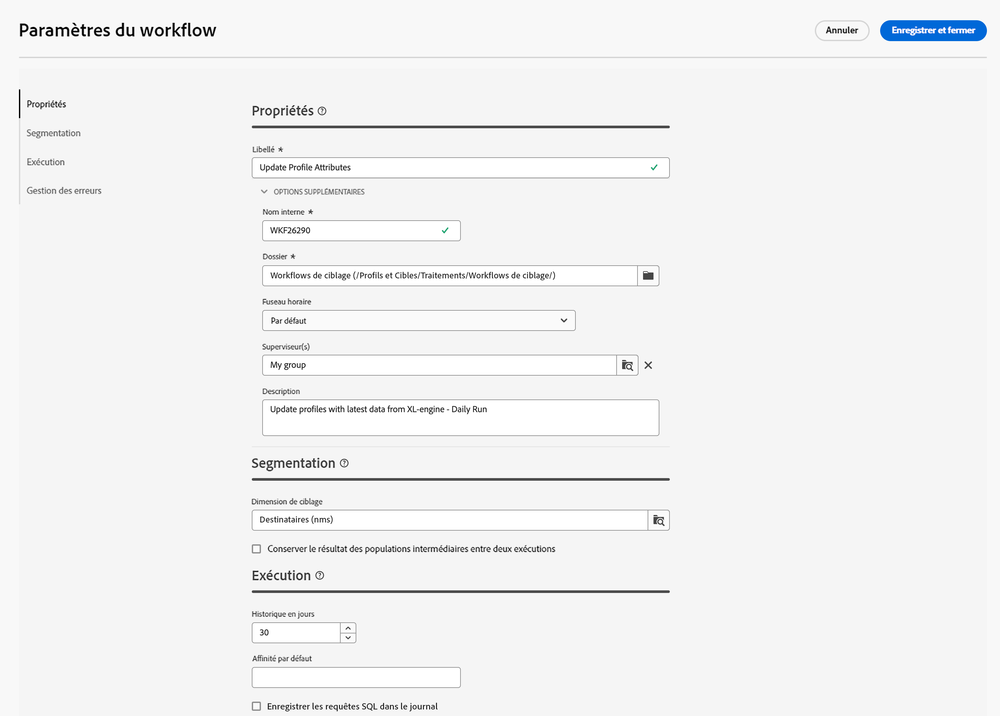

# Configurer les paramètres de workflow {#workflow-settings}

Lors de l’orchestration des activités de workflow dans la zone de travail, vous pouvez accéder aux paramètres avancés liés au workflow. Par exemple, vous pouvez définir un fuseau horaire spécifique pour le workflow, gérer le comportement du workflow en cas d’erreur ou gérer le délai après lequel l’historique du workflow doit être purgé.

Ces paramètres sont préconfigurés dans le modèle sélectionné lors de la création du workflow, mais peuvent être modifiés selon les besoins pour ce workflow spécifique.

Pour ce faire, cliquez sur le bouton **[!UICONTROL Paramètres de workflow]** dans le coin supérieur gauche de la zone de travail, en regard du libellé du workflow.

## Propriétés de workflow  {#properties}

>[!CONTEXTUALHELP]
>id="acw_workflow_settings_properties"
>title="Propriétés de workflow"
>abstract="À déterminer"

Le **[!UICONTROL Propriétés]** fournit des paramètres génériques qui sont également accessibles lors de la création du workflow.

* **[!UICONTROL Libellé]**: Libellé du workflow qui s’affiche dans la liste.
* **[!UICONTROL Nom]**: Nom interne du workflow.
* **[!UICONTROL Dossier]**: Dossier dans lequel le workflow doit être enregistré.
* **[!UICONTROL Campagne liée]**: Ce champ s&#39;affiche si le workflow a été créé dans une campagne. Il vous permet d’ouvrir la campagne associée.
* **[!UICONTROL Fuseau horaire]**: Définissez un fuseau horaire spécifique à utiliser par défaut dans toutes les activités du workflow. Par défaut, le fuseau horaire du workflow est celui défini pour l’opérateur de Campaign actuel.
* **[!UICONTROL Superviseur(s)]**: Lorsqu&#39;un workflow est en erreur, le ou les opérateurs appartenant au groupe de supervision du workflow sont avertis par email, sous réserve que leur adresse email soit indiquée dans leur profil.
* **[!UICONTROL Description]**: Utilisez ce champ pour fournir une description de votre workflow.

## Paramètres de segmentation

>[!CONTEXTUALHELP]
>id="acw_workflow_settings_segmentation"
>title="Paramètres de segmentation"
>abstract="À déterminer"

* **[!UICONTROL Dimension de ciblage]**: Sélectionnez la dimension de ciblage à utiliser pour cibler les profils : destinataires, bénéficiaires d&#39;un contrat, opérateur, abonnés, etc.
* **[!UICONTROL Conserver le résultat des populations intermédiaires entre deux exécutions]**: Par défaut, seules les tables de travail de la dernière exécution du workflow sont conservées. Les tables de travail des exécutions précédentes sont purgées par un workflow technique qui s’exécute tous les jours.

   Si cette option est activée, les tables de travail seront conservées même après l&#39;exécution du workflow. Vous pouvez l’utiliser à des fins de test et par conséquent ne doit être utilisé que dans les environnements de développement ou d’évaluation. Elle ne doit jamais être vérifiée dans un workflow de production.

## Paramètres d&#39;exécution

>[!CONTEXTUALHELP]
>id="acw_workflow_settings_execution"
>title="Paramètres d’exécution"
>abstract="À déterminer"

* **[!UICONTROL Jours d&#39;historique]**: Indique le nombre de jours après lesquels l’historique doit être purgé. L&#39;historique contient des éléments liés au workflow : logs, tâches, événements (objets techniques liés à l&#39;opération du workflow). La valeur par défaut est de 30 jours pour les modèles de workflow d’usine. La purge de l’historique est effectuée par le workflow technique de nettoyage de la base de données, qui est exécuté par défaut tous les jours.

   >[!IMPORTANT]
   >
   >Si le champ **[!UICONTROL Jours d’historique]** n’est pas renseigné, la valeur prise en compte est « 1 », ce qui signifie que l’historique sera purgé après 1 jour.

* **[!UICONTROL Affinité par défaut]**: Si votre installation comprend plusieurs serveurs de workflow, utilisez ce champ pour choisir la machine sur laquelle le workflow sera exécuté. Si la valeur définie dans ce champ n&#39;existe sur aucun serveur, le workflow reste en attente.

* **[!UICONTROL Enregistrer les requêtes SQL dans le journal]**: permet d&#39;enregistrer les requêtes SQL du workflow dans les logs. Cette fonctionnalité est réservée aux utilisateurs avancés. Il s’applique aux workflows qui contiennent des activités de ciblage telles que **[!UICONTROL Créer une audience]**. Lorsque cette option est activée, les requêtes SQL envoyées à la base lors de l&#39;exécution du workflow s&#39;affichent dans Adobe Campaign, ce qui permet de les analyser afin d&#39;optimiser les requêtes ou de diagnostiquer les problèmes.

   Les requêtes sont affichées dans une **[!UICONTROL Journaux SQL]** de l&#39;onglet qui est ajouté au workflow (à l&#39;exception des workflows d&#39;opération) et au **[!UICONTROL Propriétés]** lorsque l’option est activée. <!-- where?-->

## Paramètres de gestion des erreurs

>[!CONTEXTUALHELP]
>id="acw_workflow_settings_error"
>title="Paramètres de gestion des erreurs"
>abstract="À déterminer"

* **[!UICONTROL Gestion des erreurs]**: Ce champ vous permet de définir les actions à effectuer si une tâche de workflow est en erreur. Deux options sont disponibles :

   * **[!UICONTROL Suspension du processus]**: Le workflow est automatiquement suspendu et son état passe à **[!UICONTROL En échec]**. Une fois le problème résolu, reprenez le workflow à l’aide de la fonction **[!UICONTROL Reprendre]** des boutons.
   * **[!UICONTROL Ignorer]**: L’état de la tâche qui a déclenché l’erreur passe à **[!UICONTROL En échec]**, mais le workflow conserve la variable **[!UICONTROL Démarré]** statut. <!-- TO ADD ONCE SCHEUDLER IS AVAILABLE This configuration is relevant for recurring tasks: if the branch includes a scheduler, it will start normally next time the workflow is executed.-->
   * **[!UICONTROL Abandonner le processus]**: Le workflow est automatiquement arrêté et son état passe à **[!UICONTROL En échec]**. Une fois le problème résolu, redémarrez le workflow à l’aide de la fonction **[!UICONTROL Début]** des boutons.

* **[!UICONTROL Erreurs consécutives]**: Ce champ devient disponible lorsque la variable **[!UICONTROL Ignorer]** est sélectionnée dans la variable **[!UICONTROL En cas d&#39;erreur]** champ . Vous pouvez indiquer le nombre d’erreurs qui peuvent être ignorées avant l’arrêt du processus. Une fois ce nombre atteint, l’état du workflow passe à **[!UICONTROL En échec]**. Si la valeur de ce champ est 0, le workflow ne sera jamais arrêté, quel que soit le nombre d’erreurs.
